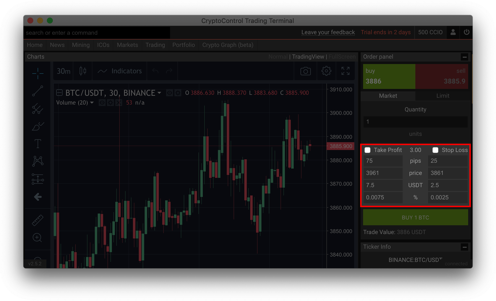
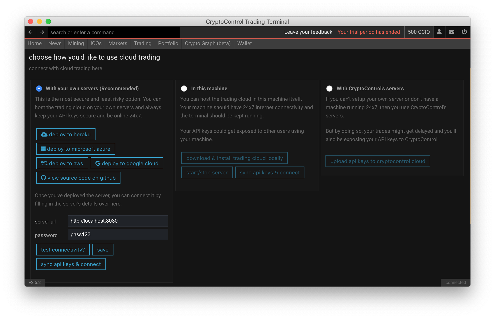
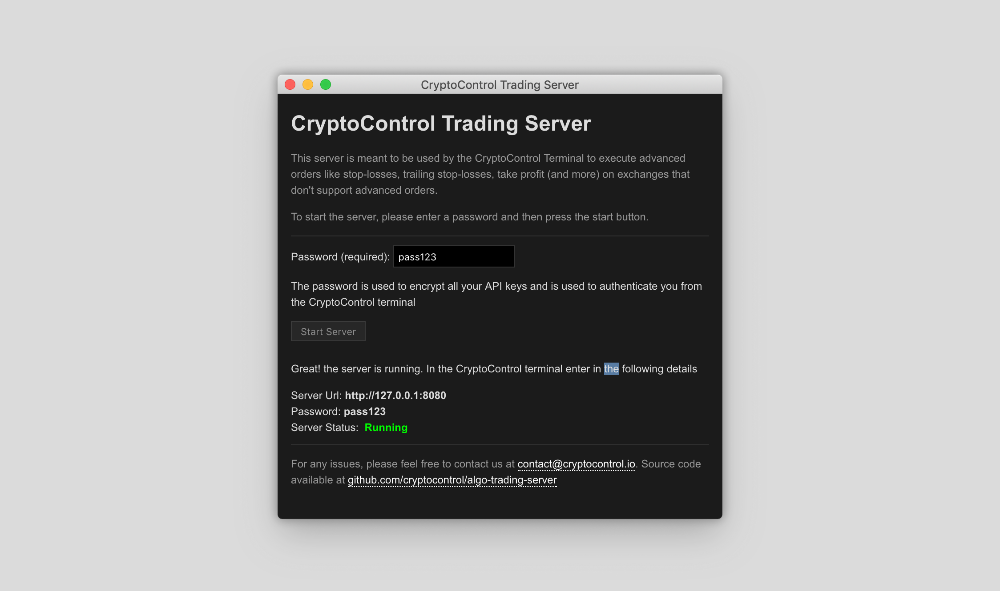

Iguana - Algo Trading Server for Advanced Orders
================================================

This server is meant to be used by the CryptoControl Terminal to execute advanced orders like stop-losses, trailing stop-losses, take profit (and more) on exchanges that don't support advanced orders.

Iguana is heavily insipired by the popular open-source bitcoin trading bot, [Gekko](https://github.com/askmike/gekko). Iguana is also a
better version of Gekko because it supports more exchanges and use websocket/FIX apis hence it is **truly real-time**.

In the screenshot below, users have the ability to execute stop-loss and take-profit orders from the trading screen within the CryptoControl Terminal, on an exchange that doesn't support these kinds of orders.



The CryptoControl Terminal allows users to host their own trading servers so that they can execute advanced orders from within the terminal itself but never expose their API keys to CryptoControl. Since the trading server is open-source, everything is transparent.

[](https://heroku.com/deploy?template=https://github.com/cryptocontrol/adv-trading-server)

For a quick start with docker-compose run
```
docker-compose up
```
or via docker, run
```
docker run -p 8080:8080 -e SERVER_SECRET=set_random_password_here cryptocontrol-trading-server
```

## Disclaimer
**USE THE SOFTWARE AT YOUR OWN RISK. YOU ARE RESPONSIBLE FOR YOUR OWN MONEY.**

**THE AUTHORS AND ALL AFFILIATES ASSUME NO RESPONSIBILITY FOR ANY DAMAGE OR LOSS CAUSED BY THIS SOFTWARE.**

**THERE CAN BE BUGS AND THE BOT MAY NOT PERFORM AS EXPECTED OR SPECIFIED. PLEASE CONSIDER TESTING IT FIRST WITH PAPER TRADING AND/OR BACKTESTING ON HISTORICAL DATA. ALSO LOOK AT THE CODE TO SEE HOW IT IS WORKS.**

## Usage
Host this server in your own machine and enter in the server's ip and password in the CryptoControl's trading's settings screen as shown below.



Once set, you'll be able to execute advanced orders straight from your terminal.


## Using in your local machine
The server can also be downloaded as an executable and run from your own machine locally.

Simply download the executable, enter in a password and click on the button to start the server. Once the server has started, copy the details back into the terminal.



<!-- ## How advanced orders work
To execute advanced orders, a server needs to be running 24x7 monitoring the price feeds of various exchanges and executing trades automatically when certain conditions are met.

Some exchanges have a real-time api (websocket or FIX) for trades which allow  -->

## Authentication
Iguana uses a password to encrypt/decrypt all API keys and to authenticate users.

If you are setting up the bot on your own cloud, then the password is taken from the environment variable `SERVER_PASSWORD`. If you're setting up the bot via the GUI, then simply enter in the password in the password field before you start the bot.

Once set, all users can simply connect to the bot from the CryptoControl terminal with the right password.


## Signals/Triggers
Iguana supports triggers, which are one-time actions that execute when a price meets a certain condition.

Supported Signals/Triggers:
- Stop Loss
- Take Profit
- Trailing Take Profit

## Strategies
Iguana supports auto-trading with various trading strategies. Strategies keep running forever and execute trades on the basis of certain conditions (like Technical Indicators).

Strategies can also be backtested for performance with historic data from an exchange.

Supported Strategies:
- RSI Strategy

You can also build your own strategies and use it with the CryptoControl terminal. For more info view [building custom strategies](./docs/CUSTOM_STRATEGIES.md).

## Supported Exchanges
The following exchanges are supported: Binance, Bittrex

## Plugins
Plugins allow Iguana to communicate to the user via multiple channels in realtime.
- Slack
- SMS Notifications (coming soon)
<!-- - blah (coming ) -->

## Upcoming Features
For any suggestions on features that you'd like to see, let us know by either submitting an issue or writing to us at contact@cryptocontrol.io

Some of the upcoming features that we're working on include:

- AI Integration
- HFT (High Frequency Trading)
- Custom Strategies
